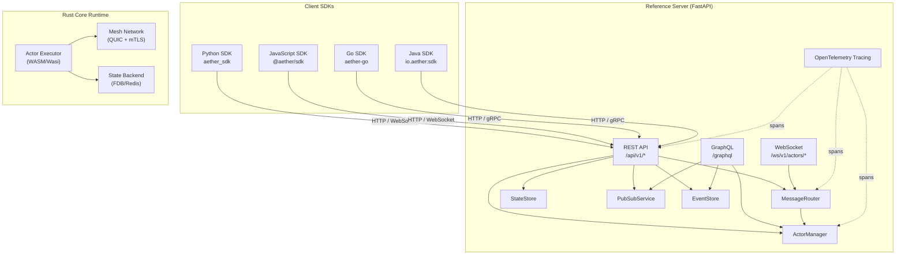

# Aether Architecture Overview

> **DEPRECATION NOTICE**: This document describes the v1.x SDK/Python-server architecture and is superseded by the root [ARCHITECTURE.md](../ARCHITECTURE.md) for the v2.0.0 Rust runtime.

## System Overview

Aether is an actor-based distributed systems framework providing SDKs for Python, JavaScript, Go, and Java, with a reference server implementation. The framework provides message-driven actors, event sourcing, pub/sub messaging, stream processing with windowing, workflow orchestration (saga, state machine, human tasks), and resilience patterns (circuit breaker, retry, bulkhead, rate limiter).

The reference server (`server/`) is a Python FastAPI application that exposes REST, WebSocket, and GraphQL APIs for actor registration, message routing, state management, event sourcing, and pub/sub. The Rust core runtime (`crates/`) provides a high-performance WASM-based execution engine with QUIC mesh networking.

---

## Architecture Diagram (Mermaid)



---

## SDK Architecture

### Python SDK (`sdks/python/aether_sdk/`)

The Python SDK is the most mature implementation with full coverage of all framework modules.

```
aether_sdk/
├── __init__.py          # Public API: Actor, actor, Capability, CapabilitySet,
│                        #   Message, MessageType, StateHandle, HttpClient, errors
├── _version.py          # Version: 1.6.0
├── actor.py             # Actor ABC + @actor decorator, mailbox, RPC (call/send/deliver)
├── capabilities.py      # Capability (Flag enum), CapabilitySet
├── messaging.py         # Message dataclass, MessageType enum (10 types),
│                        #   JSON serialization (to_json/from_json)
├── state.py             # StateHandle — async key-value store with JSON helpers
├── http.py              # HttpClient — async aiohttp wrapper gated by NETWORK_OUTBOUND
├── exceptions.py        # AetherError, CapabilityDenied, ActorNotFound, RpcError
├── capabilities.py      # 13 capability flags (NETWORK_OUTBOUND, STATE_READ, etc.)
├── resilience/
│   ├── circuit_breaker.py  # CircuitBreaker, CircuitBreakerConfig, CircuitBreakerManager
│   ├── retry.py            # RetryPolicy, RetryConfig, BackoffStrategy (4 strategies)
│   ├── rate_limiter.py     # RateLimiter, RateLimitConfig, RateLimitStrategy
│   ├── bulkhead.py         # Bulkhead, BulkheadConfig (max_concurrent + queue)
│   ├── health_check.py     # HealthChecker, HealthStatus, HealthReport
│   ├── tracing.py          # OpenTelemetry integration, ResilienceInstrumentation
│   └── __init__.py         # ResilientExecutor (combines all 4 patterns)
├── event/
│   ├── pubsub.py           # PubSubClient, PubSubBackend (ABC), InMemoryPubSub,
│   │                       #   Topic, Subscription, PubSubMessage, @subscribe decorator
│   ├── event_sourcing.py   # EventStore, Aggregate, EventEnvelope, EventVersion,
│   │                       #   InMemoryEventStore, projection support
│   ├── schema.py           # EventSchemaRegistry, schema validation
│   ├── delivery.py         # Guaranteed delivery (at-least-once, exactly-once)
│   └── __init__.py
├── streaming/
│   ├── types.py            # StreamEvent, Timestamp, Duration, WindowSpec,
│   │                       #   Watermark, BackpressureStrategy, BackpressureConfig
│   ├── window.py           # TumblingWindow, SlidingWindow, SessionWindow
│   ├── backpressure.py     # BackpressureController (BUFFER/DROP/FAIL/LATEST)
│   ├── batch.py            # BatchCollector, BatchProcessor
│   ├── partition.py        # Partitioner, PartitionProcessor, KeyExtractor
│   ├── zero_copy.py        # MemoryPool, PooledBuffer, RingBuffer, ZeroCopyEmitter
│   ├── stream_actor.py     # StreamActor — continuous data processing actor
│   └── __init__.py
├── workflow/
│   ├── saga.py             # Saga, SagaStep, SagaExecutor — distributed transactions
│   ├── state_machine.py    # StateMachine — transitions with guards and actions
│   ├── human_task.py       # HumanTask — blocking tasks with timeouts
│   ├── types.py            # SagaStatus, StepStatus, SagaContext, SagaResult, Duration
│   └── __init__.py
└── validation/
    ├── validators.py       # Fluent validation API (email, UUID, regex, etc.)
    ├── sanitize.py         # Input sanitization (HTML, SQL, URL, JSON)
    └── __init__.py
```

**Key Design Patterns:**
- **Actor Model**: Abstract base class with async mailbox (`asyncio.Queue`), RPC via correlation IDs, lifecycle hooks (`on_start`, `on_stop`)
- **Capability-Based Security**: `Capability` flags granted at actor creation, enforced at runtime (e.g., `HttpClient` checks `NETWORK_OUTBOUND`)
- **Strategy Pattern**: Backpressure (`BUFFER/DROP/FAIL/LATEST`), backoff (`FIXED/LINEAR/EXPONENTIAL/EXPONENTIAL_JITTER`)
- **Template Method**: `Actor.handle_message()` as abstract method, `_process_item()` as template
- **Decorator Pattern**: `@actor` decorator converts plain class to actor, `@subscribe` marks pub/sub handlers
- **Manager Pattern**: `CircuitBreakerManager`, `RateLimiterManager`, `BulkheadManager` provide named instance registries

### JavaScript SDK (`sdks/javascript/src/`)

Mirror of the Python SDK in TypeScript with equivalent module structure.

```
src/
├── index.ts          # Public API exports
├── actor.ts          # Actor class, @actor decorator
├── capabilities.ts   # Capability enum, CapabilitySet
├── messaging.ts      # Message, MessageType, Priority
├── state.ts          # StateHandle
├── http.ts           # HttpClient, HttpResponse
├── errors.ts         # AetherError, CapabilityDenied, ActorNotFound, RpcError
├── types.ts          # ActorConfig, MessageHandler, RpcHandler
├── resilience/       # CircuitBreaker, RetryPolicy, RateLimiter, Bulkhead, HealthCheck, tracing
├── event/            # pubsub, event_sourcing, schema, types
├── streaming/        # window, backpressure, stream_actor, types, batch, partition, zero_copy
├── workflow/         # saga, state_machine, human_task, types
└── validation/       # validators, sanitize
```

### Go SDK (`sdks/go/aether/`)

Idiomatic Go implementation using interfaces and struct embedding.

```
aether/
├── doc.go            # Package documentation with quick-start guide
├── actor.go          # Actor interface, BaseActor (embeddable), mailbox via channels
├── message.go        # Message struct, MessageType constants, JSON serialization
├── capabilities.go   # Capability type, CapabilitySet, NewCapabilitySet()
├── state.go          # StateHandle with Read/Write/Delete/ReadJSON/WriteJSON
├── capabilities.go   # Capability type (int64 bitmask), CapabilitySet
├── errors.go         # Error types with codes (ErrCodeRpcError, ErrCodeTimeout)
├── helpers.go        # NewMessage, NewResponse, NewRPCRequest helpers
├── version.go        # Version constant
├── resilience/       # circuit_breaker, retry, rate_limiter, bulkhead, health_check,
│                     #   executor, tracing
├── streaming/        # window, backpressure, stream_actor, types, batch, partition,
│                     #   zero_copy
├── workflow/         # types (Duration, enums, contexts)
└── validation/       # validators, sanitize
```

**Key Design Patterns:**
- **Interface + Embedding**: `Actor` interface with `BaseActor` struct for default implementations
- **Channel-based Mailbox**: `chan mailboxItem` with `select`-based event loop in `Run()`
- **Context Propagation**: `context.Context` passed to all handlers and operations
- **Error Values**: Typed errors with codes via `NewError(code, message, cause)`

### Java SDK (`sdks/java/`)

Two-module Maven project with core SDK and workflow extensions.

```
aether-sdk/
├── src/main/java/io/aether/sdk/
│   ├── actor/Actor.java          # Abstract base with handler map, RPC support
│   ├── messaging/Message.java     # Builder pattern, MessageType enum, Priority
│   ├── state/StateHandle.java     # Key-value with capability checks
│   ├── capabilities/Capability.java  # Enum, CapabilitySet
│   ├── resilience/                # CircuitBreaker, RetryPolicy, RateLimiter, Bulkhead
│   ├── streaming/                 # Window, Backpressure, StreamActor, Types, Batch,
│   │                              #   Partition, ZeroCopy
│   ├── validation/                # Validator (fluent), Sanitizer
│   └── errors/AetherException.java # Exception hierarchy
└── src/main/java/io/aether/workflow/
    ├── Saga.java          # Saga pattern with steps and compensation
    ├── Workflow.java      # Base workflow
    ├── WorkflowExecutor.java # Execution engine
    ├── StateMachine.java  # State machine with transitions
    ├── HumanTask.java     # Human-in-the-loop tasks
    └── Types.java         # Shared workflow types
```

**Key Design Patterns:**
- **Handler Map**: `Map<String, Consumer<Message>>` for type-based message routing
- **Builder Pattern**: `Message.builder().type(...).payload(...).build()`
- **CompletableFuture**: Async lifecycle via `onActivate()` / `onDeactivate()`
- **Generics**: `addRpcHandler<T, R>(String type, Function<T, R> handler)`

---

## Server Architecture

The reference server is a Python FastAPI application in `server/`.

### Components

| Component | File | Description |
|-----------|------|-------------|
| **App Factory** | `app.py` | FastAPI app creation, CORS middleware, request ID middleware, lifespan management, router mounting |
| **ActorManager** | `actor_manager.py` | In-memory actor registry (register, unregister, get, list, heartbeat, status update). Configurable max actors (default 10,000). |
| **MessageRouter** | `message_router.py` | Routes `MessageEnvelope` to registered handlers or buffers pending messages. Supports sync/async handlers. Tracks delivery receipts. |
| **StateStore** | `state_store.py` | Thread-safe key-value store with optimistic concurrency (version checking). Supports change callbacks. |
| **PubSubService** | `pubsub_service.py` | Topic-based pub/sub with wildcard matching (fnmatch), message history, subscription management. |
| **EventStore** | `event_store.py` | Event-sourced storage with aggregate-scoped event streams, version tracking, snapshots. Bounded history (default 10,000). |
| **Tracing** | `tracing.py` | OpenTelemetry integration with `trace_span` context manager, `@traced` decorator, trace ID propagation in response headers. |
| **Config** | `config.py` | `ServerConfig` dataclass: host, port, max_actors, message_ttl_seconds, state_backend, version |
| **Models** | `models.py` | Pydantic models: `ActorRegistration`, `ActorInfo`, `MessageEnvelope`, `DeliveryReceipt`, `StateEntry`, `PubSubMessage`, `Subscription`, `EventRecord`, `HealthResponse`, request/response types |
| **WebSocket Handler** | `websocket_handler.py` | `ConnectionManager` for per-actor WebSocket connections, ping/pong, message routing, broadcast |

### API Routes

| Route | Method | Handler | Description |
|-------|--------|---------|-------------|
| `/api/v1/actors` | POST | `actors.register_actor` | Register a new actor (201) |
| `/api/v1/actors/{id}` | GET | `actors.get_actor` | Get actor info |
| `/api/v1/actors/{id}` | DELETE | `actors.unregister_actor` | Unregister actor (204) |
| `/api/v1/actors` | GET | `actors.list_actors` | List actors (filter by type, status) |
| `/api/v1/actors/{id}/messages` | POST | `actors.send_message` | Send message to actor (202) |
| `/api/v1/actors/{id}/messages` | GET | `actors.get_pending_messages` | Get pending messages |
| `/api/v1/actors/{id}/heartbeat` | POST | `actors.heartbeat` | Update actor heartbeat (204) |
| `/api/v1/state/{actor}/{key}` | GET | `state.get_state` | Get state value |
| `/api/v1/state/{actor}/{key}` | PUT | `state.set_state` | Set state value (with version check) |
| `/api/v1/state/{actor}/{key}` | DELETE | `state.delete_state` | Delete state (204) |
| `/api/v1/state/{actor}` | GET | `state.get_all_state` | Get all state for actor |
| `/api/v1/events/publish` | POST | `events.publish` | Publish to topic (202) |
| `/api/v1/events/subscribe` | POST | `events.subscribe` | Subscribe to topic (201) |
| `/api/v1/events/subscribe/{id}` | DELETE | `events.unsubscribe` | Unsubscribe (204) |
| `/api/v1/events/topics` | GET | `events.list_topics` | List active topics |
| `/api/v1/events/topics/{topic}/history` | GET | `events.topic_history` | Get topic message history |
| `/api/v1/events/append` | POST | `events.append_event` | Append event to aggregate (201) |
| `/api/v1/events/{aggregate}` | GET | `events.get_events` | Get events for aggregate |
| `/ws/v1/actors/{id}` | WebSocket | `ws.websocket_endpoint` | Real-time actor communication |
| `/graphql` | POST | `graphql.graphql_app` | GraphQL queries and mutations |
| `/health` | GET | `health.health` | Health check |
| `/health/ready` | GET | `health.ready` | Readiness check |
| `/api/v1/info` | GET | `health.info` | Server info and version |

### Data Flow

```
Client Request
    │
    ├── Request ID Middleware (X-Request-ID, X-Trace-Id)
    │
    ├── CORS Middleware
    │
    ├── Route Handler
    │   ├── trace_span() — OpenTelemetry span
    │   ├── Business Logic (ActorManager / MessageRouter / StateStore / etc.)
    │   └── Response (Pydantic model serialization)
    │
    └── Response Headers (X-Request-ID, X-Trace-Id)
```

### Startup Lifecycle

```python
@asynccontextmanager
async def lifespan(app):
    # 1. Setup OpenTelemetry tracing
    setup_tracing()
    # 2. Load configuration
    config = ServerConfig()
    # 3. Initialize all services
    _actor_manager = ActorManager(config)
    _message_router = MessageRouter(message_ttl=config.message_ttl_seconds)
    _state_store = StateStore()       # In-memory (Redis in future)
    _pubsub_service = PubSubService()
    _event_store = EventStore()
    yield
    # 4. Graceful shutdown
```

---

## Communication Protocol

### REST API

All REST endpoints use JSON request/response bodies with Pydantic model validation.

**Message Format (MessageEnvelope):**
```json
{
  "source_actor": "order-service",
  "target_actor": "payment-service",
  "message_type": "command",
  "payload": {"orderId": "123", "amount": 99.99},
  "correlation_id": "uuid-v4",
  "timestamp": "2026-03-27T12:00:00Z",
  "priority": 0,
  "message_id": "msg_1743062400000000"
}
```

**Delivery Receipt:**
```json
{
  "message_id": "msg_1743062400000000",
  "status": "delivered | buffered | failed",
  "delivered_at": "2026-03-27T12:00:00Z",
  "correlation_id": "uuid-v4"
}
```

### WebSocket Protocol

WebSocket connections are per-actor at `/ws/v1/actors/{actor_id}`. Messages are JSON frames.

**Client → Server:**
```json
{"type": "ping"}
{"type": "message", "target": "payment-service", "message_type": "command", "payload": {...}}
{"type": "subscribe", "topic": "orders.*"}
```

**Server → Client:**
```json
{"type": "pong"}
{"type": "delivery", "message_id": "...", "status": "delivered"}
{"type": "message", "source": "order-service", "payload": {...}, "message_id": "...", "status": "delivered"}
{"type": "error", "message": "Missing target"}
```

### GraphQL API

Powered by Strawberry (`strawberry` + `strawberry.fastapi`). Optional dependency — server starts without it if not installed.

**Queries:** `actors`, `actor(id)`, `actor_state(id)`, `events(aggregateId, eventType)`, `topics`, `topic_history(topic, limit)`

**Mutations:** `registerActor(actorId, actorType)`, `sendMessage(target, payload, messageType)`, `setState(actorId, key, value)`

### Mesh Protocol (gRPC)

Defined in `mesh-protocol.proto`:
```protobuf
message ActorPacket {
    string source_actor_id = 1;
    string target_actor_id = 2;
    uint64 trace_id = 3;
    bytes payload = 4;
}

message Handshake {
    string node_id = 1;
    bytes public_key = 2;
    uint32 protocol_version = 3;
}

message FlowControl {
    enum Action { PAUSE = 0; RESUME = 1; }
    Action action = 1;
    uint64 buffer_remaining = 2;
}
```

---

## State Management

### Actor State (StateHandle)

Each actor has a `StateHandle` providing a key-value store:

- **Python**: `StateHandle` — async `get/set/delete/get_json/set_json` on an in-memory `Dict[str, bytes]`
- **Go**: `StateHandle` — sync `Read/Write/Delete/ReadJSON/WriteJSON` on `map[string][]byte`
- **JavaScript**: `StateHandle` — async get/set/delete with JSON helpers on `Map<string, any>`
- **Java**: `StateHandle` — get/set/delete with capability-gated access

### Server-Side State (StateStore)

The server's `StateStore` provides versioned state per actor:

```python
entry = store.set(actor_id="order-1", key="status", value="shipped", expected_version=3)
# Returns StateEntry(actor_id, key, value, version=4, updated_at)
```

- **Optimistic Concurrency**: `expected_version` parameter prevents lost updates
- **Thread-Safe**: Uses `threading.Lock` for concurrent access
- **Change Callbacks**: `on_change(callback)` for reactive state updates

### Event-Sourced State (EventStore)

The server's `EventStore` implements event sourcing:

```python
record = event_store.append(
    aggregate_id="order-1",
    event_type="OrderShipped",
    data={"trackingId": "ABC123"},
    expected_version=3
)
# Returns EventRecord(event_id, aggregate_id, event_type, data, version=4)
```

- **Aggregate-Scoped Streams**: Events are grouped by `aggregate_id`
- **Version Tracking**: Monotonically increasing version per aggregate
- **Snapshots**: `create_snapshot(aggregate_id, state)` for projection optimization
- **Bounded History**: Configurable `history_size` (default 10,000)

---

## Resilience Patterns

All four SDKs implement the same resilience patterns with consistent APIs.

### Circuit Breaker

Prevents cascading failures with three states:

| State | Behavior | Transition |
|-------|----------|------------|
| **CLOSED** | Requests pass through | → OPEN after `failure_threshold` failures |
| **OPEN** | Requests rejected immediately | → HALF_OPEN after `timeout_ms` |
| **HALF_OPEN** | Limited probe requests | → CLOSED after `success_threshold` successes, → OPEN on failure |

Configuration: `failure_threshold`, `success_threshold`, `timeout_ms`, `half_open_max_calls`, `failure_window_ms` (sliding window). State change callbacks: `on_open`, `on_close`, `on_half_open`.

### Retry Policy

Handles transient failures with configurable backoff:

- **Strategies**: `FIXED`, `LINEAR`, `EXPONENTIAL`, `EXPONENTIAL_JITTER`
- **Configuration**: `max_attempts`, `base_delay_ms`, `max_delay_ms`, `multiplier`, `jitter_factor`
- **Retryable Check**: `is_retryable(error, attempt) -> bool` callback

Pre-configured policies: `network_retry_policy`, `database_retry_policy`, `aggressive_retry_policy`, `conservative_retry_policy`.

### Bulkhead

Resource isolation through concurrency limiting:

- **Configuration**: `max_concurrent` (execution slots), `max_queued` (wait queue), `timeout_ms`
- **Errors**: `BulkheadRejectedError` (queue full), `BulkheadTimeoutError` (wait expired)

Pre-configured: `api_bulkhead`, `database_bulkhead`, `strict_bulkhead`.

### Rate Limiter

Controls request rates per actor/capability:

- **Strategies**: Token bucket, sliding window, fixed window
- **Per-actor limits**: Configurable tokens/second per actor

### ResilientExecutor

Combines all patterns in a single execution pipeline:

```
Request → Rate Limiter → Bulkhead → Circuit Breaker → Retry → Function
```

### Tracing Integration

OpenTelemetry integration wraps all resilience operations:

- `traced_circuit_breaker` — traces state transitions
- `traced_retry` — traces retry attempts
- `traced_rate_limiter` — traces rate limit decisions
- `traced_bulkhead` — traces queue/execute/reject
- `ResilienceInstrumentation` — unified span and metric recording

---

## Event-Driven Architecture

### Pub/Sub Messaging

Topic-based publish/subscribe with actor integration.

**Topic Model:**
- Hierarchical names using `.` as separator (e.g., `orders.created`)
- Wildcard subscriptions with `*` per segment
- Configurable partitions and retention
- Compacted topics (latest value per key)

**SDK Client API:**
```python
client = PubSubClient()
await client.create_topic(Topic(name="orders", partitions=4))
await client.publish("orders", {"orderId": "123"}, key="order-123")
await client.subscribe("orders.*", handler=my_handler)
await client.subscribe_actor("orders.*", my_actor, method_name="handle_event")
```

**Server API:**
- `POST /api/v1/events/publish` — publish to topic
- `POST /api/v1/events/subscribe` — create subscription
- `GET /api/v1/events/topics/{topic}/history` — retrieve message history

**Backend Abstraction:**
- `PubSubBackend` (ABC) — `create_topic`, `publish`, `publish_batch`, `subscribe`, `unsubscribe`, `acknowledge`
- `InMemoryPubSub` — synchronous in-process routing
- Future: Redis Streams, Kafka, NATS

### Event Sourcing

Persist state as an immutable sequence of events per aggregate.

**SDK API:**
```python
class Order(Aggregate):
    def apply_order_created(self, event):
        self.status = "created"
        self.items = event["items"]

store = InMemoryEventStore()
await store.append("order-123", {"type": "order_created", "items": [...]})
events = await store.get_events("order-123")
```

**Server API:**
- `POST /api/v1/events/append` — append event (with version check)
- `GET /api/v1/events/{aggregate_id}` — retrieve event stream

### Schema Registry

Event schema validation ensures compatibility across producers and consumers:
- Schema registration with versioning
- Compatibility checking (forward, backward, full)
- Validation of event data against registered schemas

---

## Deployment Topology

### Single-Node (Development)

```
┌─────────────────────────────┐
│   Aether Server (FastAPI)   │
│   ┌───────────────────────┐ │
│   │ In-Memory State       │ │
│   │ In-Memory PubSub      │ │
│   │ In-Memory EventStore  │ │
│   └───────────────────────┘ │
│   REST :8080  WebSocket :8080│
└─────────────────────────────┘
         ▲
         │ HTTP/WS
    ┌────┴────┐
    │  SDKs   │
    └─────────┘
```

### Clustered (Production)

```
┌──────────────┐  ┌──────────────┐  ┌──────────────┐
│  Aether Node │  │  Aether Node │  │  Aether Node │
│  (FastAPI)   │  │  (FastAPI)   │  │  (FastAPI)   │
└──────┬───────┘  └──────┬───────┘  └──────┬───────┘
       │                 │                 │
       └────────┬────────┘─────────────────┘
                │ QUIC Mesh (mTLS)
       ┌────────┴────────┐
       │   Redis Cluster  │
       │ (State + PubSub) │
       └─────────────────┘
       ┌─────────────────┐
       │   PostgreSQL    │
       │  (Event Store)  │
       └─────────────────┘
       ┌─────────────────┐
       │ Prometheus +    │
       │ Grafana         │
       └─────────────────┘
```

### Kubernetes

Helm chart at `deploy/helm/aether/` provides:
- Deployment with configurable replicas
- Service (ClusterIP + LoadBalancer)
- Ingress for REST, WebSocket, gRPC
- HorizontalPodAutoscaler (CPU/memory/custom metrics)
- PodDisruptionBudget for rolling updates
- ConfigMap and Secret for configuration

Terraform modules at `deploy/terraform/` for cloud provisioning.

---

## Streaming Architecture

### Windowing

Three window types for stream processing:

| Window | Description | Use Case |
|--------|-------------|----------|
| **Tumbling** | Fixed-size, non-overlapping | Minute-by-minute aggregations |
| **Sliding** | Fixed-size, overlapping | Moving averages |
| **Session** | Dynamic, activity-gap based | User sessions |

**Watermark-Based Triggers:**
- `Watermark` signals event-time progress
- Late data handling via allowed lateness
- Early firing before watermark arrival

### Backpressure

Four strategies for flow control:

| Strategy | Behavior |
|----------|----------|
| **BUFFER** | Buffer events up to capacity, then apply overflow policy |
| **DROP** | Drop new events when buffer is full |
| **FAIL** | Raise error when buffer is full |
| **LATEST** | Keep only the most recent events, drop oldest |

### Performance Modules

- **Zero-Copy**: `MemoryPool`, `PooledBuffer`, `RingBuffer`, `ZeroCopyEmitter` for zero-allocation message passing
- **Batch Processing**: `BatchCollector`, `BatchProcessor` for efficient bulk operations
- **Partitioning**: `Partitioner`, `PartitionProcessor`, `KeyExtractor` for parallel stream processing

---

## Workflow Orchestration

### Saga Pattern

Distributed transaction coordination with compensation:

```python
saga = Saga("order-processing") \
    .step("reserve-inventory").action(reserve_fn).compensate(release_fn) \
    .step("process-payment").action(charge_fn).compensate(refund_fn) \
    .step("ship-order").action(ship_fn).compensate(cancel_fn) \
    .build()
result = await executor.execute(saga, {"order_id": "123"})
```

Features: step-level retry, compensation with reverse ordering, saga context propagation, timeout per step.

### State Machine

Declarative state transitions with guards and actions:

```python
sm = StateMachine("order") \
    .state("pending") \
    .state("paid") \
    .state("shipped") \
    .transition("pending", "paid", guard=is_payment_valid, action=confirm_payment) \
    .transition("paid", "shipped", action=create_shipment)
```

### Human Task

Blocking tasks that require external human input with configurable timeouts.

---

## Technology Stack

| Component | Technology | Version | Notes |
|-----------|-----------|---------|-------|
| Python SDK | Python | 3.11+ | asyncio, aiohttp |
| JavaScript SDK | TypeScript | 5.x | Node.js 18+ |
| Go SDK | Go | 1.22+ | github.com/google/uuid |
| Java SDK | Java | 17+ | Maven, CompletableFuture |
| Reference Server | Python + FastAPI | 3.11+ | Pydantic, uvicorn |
| GraphQL | Strawberry | 0.239+ | Optional dependency |
| Tracing | OpenTelemetry | 1.28+ | OTLP export |
| Mesh Protocol | Protocol Buffers | proto3 | mesh-protocol.proto |
| Mesh Transport | QUIC (quinn) | - | Rust core runtime |
| API Docs | Sphinx + TypeDoc | - | Python + JavaScript |
| CI/CD | GitHub Actions | - | Multi-workflow |
| Container | Docker | - | Multi-stage builds |
| Orchestration | Kubernetes + Helm | - | deploy/helm/aether/ |
| IaC | Terraform | - | deploy/terraform/ |
| Monitoring | Prometheus + Grafana | - | 21 alerting rules, 18 dashboard panels |
| WASM Runtime | Wasmtime | - | Rust core execution engine |
| MicroVM | Firecracker | - | Optional VM isolation |

---

## Cross-SDK Compatibility

All four SDKs share the same message format and protocol:

**Message Types (consistent across SDKs):**
| Type | Value | Purpose |
|------|-------|---------|
| START | `start` | Signal actor start |
| STOP | `stop` | Signal actor stop |
| SIGNAL | `signal` | General-purpose signal |
| RPC_REQUEST | `rpc_request` | Request-response call |
| RPC_RESPONSE | `rpc_response` | RPC reply |
| CUSTOM | `custom` | User-defined message |
| STREAM_EVENT | `stream_event` | Streaming data event |
| WATERMARK | `watermark` | Event-time progress |
| CHECKPOINT | `checkpoint` | Exactly-once barrier |
| CHECKPOINT_ACK | `checkpoint_ack` | Checkpoint acknowledgment |

**Contract Tests:** Shared test vectors (`tests/integration/test_vectors.json`) ensure serialization compatibility for messages, timestamps, durations, window specs, watermarks, enum values, and resilience patterns.

---

## Security Model

### Capability System

13 fine-grained capability flags enforced at runtime:

| Capability | Description |
|-----------|-------------|
| `NETWORK_OUTBOUND` | Outbound network connections |
| `NETWORK_INBOUND` | Inbound network connections (server) |
| `STATE_READ` | Read from state storage |
| `STATE_WRITE` | Write to state storage |
| `FS_READ` | Filesystem read operations |
| `FS_WRITE` | Filesystem write operations |
| `ACTOR_MESSAGING` | Send messages to other actors |
| `LOG` | Write to logs |
| `TIME` | Access system time |
| `RANDOM` | Generate random numbers |
| `ENVIRONMENT` | Access environment variables |
| `HTTP_CLIENT` | HTTP client operations |
| `HTTP_SERVER` | HTTP server operations |

**Enforcement:** Capabilities are declared at actor creation via `require()` (Python/Go) or constructor (Java) and cannot be escalated at runtime. The `HttpClient` is a concrete example — it raises `CapabilityDenied` if `NETWORK_OUTBOUND` is not granted.

### Transport Security (Rust Core)

- mTLS mandatory for all mesh connections (Ed25519 certificates, TLS 1.3)
- RBAC with default-deny policy
- Tamper-evident audit logging with cryptographic chains
- WASM sandboxing for memory isolation
