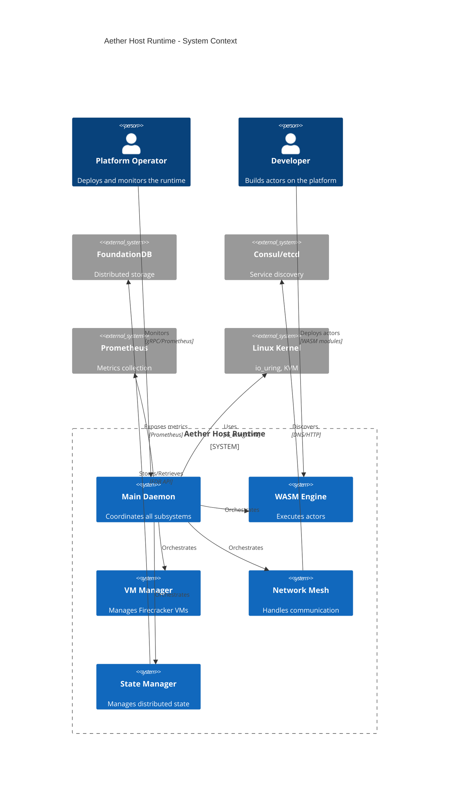
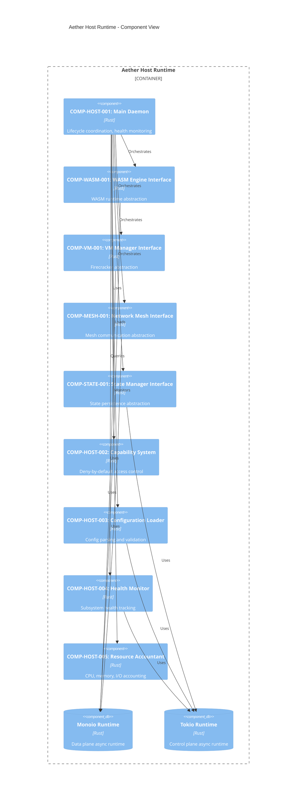
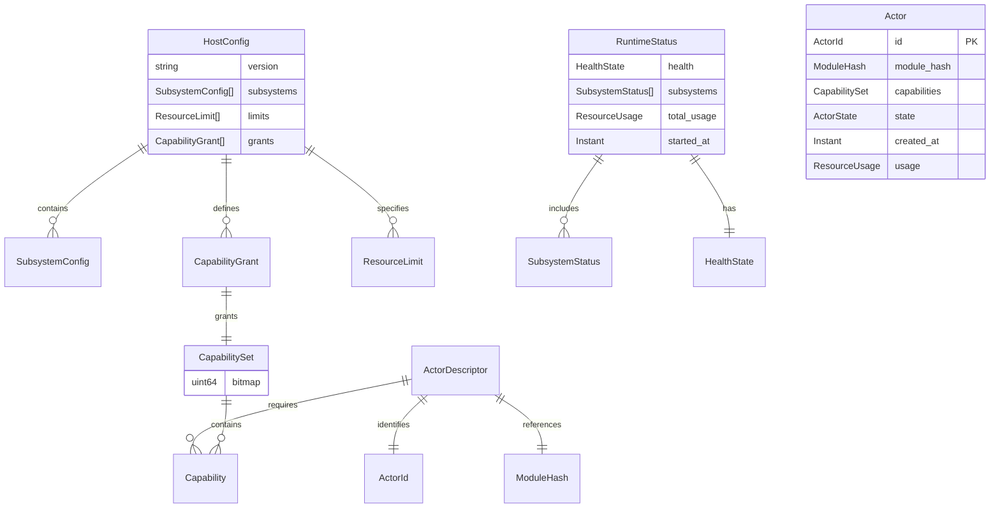
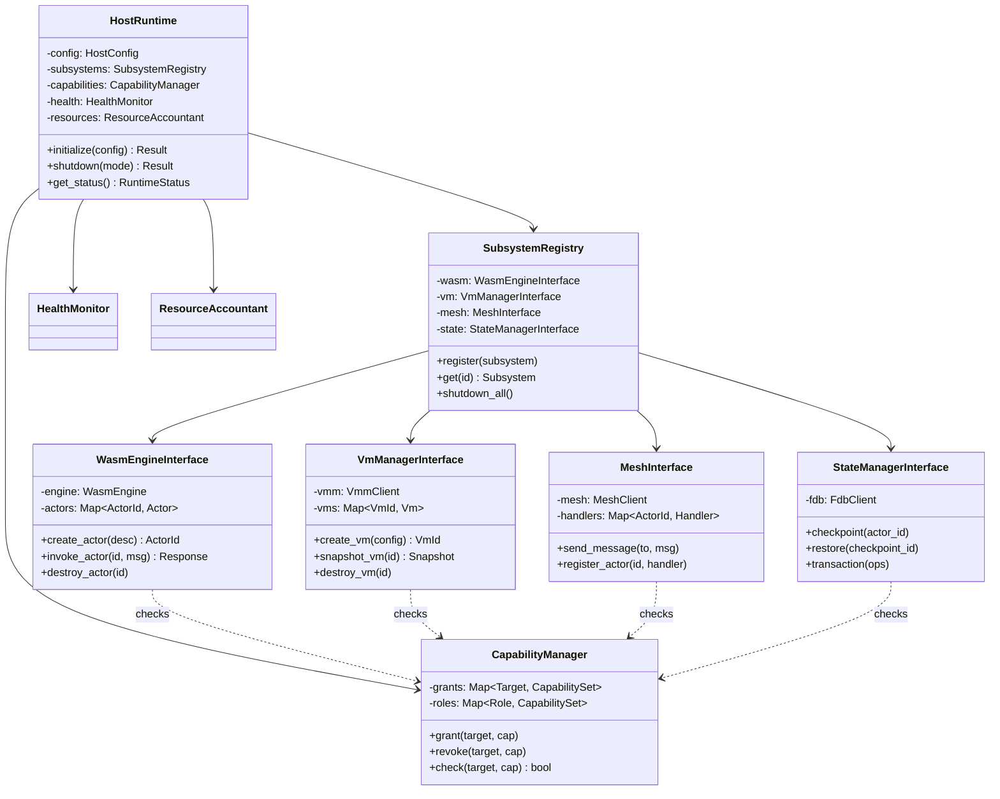
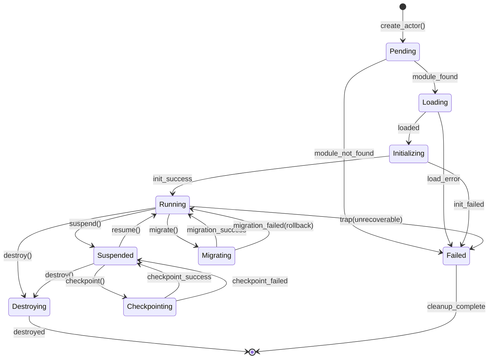
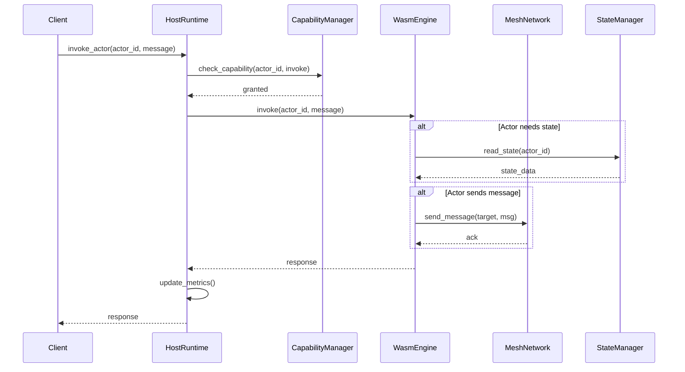

# BP-HOST-RUNTIME-001: Aether Host Runtime Architecture

**Document ID:** BP-HOST-RUNTIME-001  
**Domain:** Architecture / Core Systems  
**Version:** 1.0.0  
**Status:** Draft  
**Standard:** IEEE 1016-2009  
**Authors:** Construct (Systems Architect)  
**Created:** 2026-03-05  
**Last Modified:** 2026-03-05  
**References:** YP-WASM-RUNTIME-001, YP-ASYNC-IOURING-001, YP-VIRT-KVM-001

---

## BP-1: Design Overview

### 1.1 System Purpose

The Aether Host Runtime is the main daemon coordinating all subsystems within Project Aether. As the central orchestrator, it enables:

1. **Subsystem Coordination**: Unified lifecycle management of WASM Engine, Firecracker VMs, Network Mesh, and State Manager
2. **Dual Runtime Architecture**: Monoio for high-performance data plane, Tokio for control plane operations
3. **Capability Enforcement**: Deny-by-default security model with O(1) verification across all subsystems
4. **Panic-Free Operation**: `panic=abort` policy ensures subsystem failures are isolated and recoverable
5. **Zero-Copy Data Path**: io_uring-based I/O eliminating kernel copies for maximum throughput

### 1.2 System Scope

| Scope Element | Description |
|---------------|-------------|
| **In Scope** | Daemon lifecycle, subsystem orchestration, capability management, configuration loading, health monitoring, graceful shutdown, resource accounting |
| **Out of Scope** | Actor scheduling algorithms, consensus protocol, persistent storage implementation, network routing |

### 1.3 Stakeholder Identification

| Stakeholder ID | Role | Responsibilities | Concerns |
|----------------|------|------------------|----------|
| SH-001 | Platform Operator | Deploys and monitors the Host Runtime | Availability, resource usage, debugging |
| SH-002 | Security Auditor | Reviews security properties | Capability enforcement, isolation |
| SH-003 | Application Developer | Builds actors running on the platform | API stability, performance |
| SH-004 | Infrastructure Team | Manages underlying infrastructure | Integration points, deployment |
| SH-005 | End Users | Uses applications built on Aether | Latency, reliability |

### 1.4 Design Viewpoints

| Viewpoint ID | Viewpoint Name | Elements Addressed | Stakeholders |
|--------------|----------------|-------------------|--------------|
| VP-001 | Context | System boundaries, external interfaces | SH-001, SH-004 |
| VP-002 | Composition | Component hierarchy, dependencies | SH-001, SH-002 |
| VP-003 | Logical | Interfaces, data flows, behavior | SH-003, SH-002 |
| VP-004 | Dependency | Coupling, integration patterns | SH-001, SH-004 |
| VP-005 | Information | Data structures, persistence | SH-003, SH-002 |
| VP-006 | Patterns | Architectural patterns used | SH-002, SH-004 |
| VP-007 | Interface | API contracts, protocols | SH-003, SH-001 |

### 1.5 System Context (C4Context Diagram)



### 1.6 Design Goals

| Goal ID | Goal | Priority | Rationale |
|---------|------|----------|-----------|
| DG-001 | Subsystem isolation | Critical | Failures in one subsystem must not crash others |
| DG-002 | Deterministic shutdown | Critical | Graceful degradation with state preservation |
| DG-003 | O(1) capability verification | High | Performance requirement for all operations |
| DG-004 | Zero configuration drift | High | Runtime state matches declared configuration |
| DG-005 | Sub-millisecond orchestration | High | Fast actor lifecycle operations |

### 1.7 Design Constraints

| Constraint ID | Constraint | Source | Impact |
|---------------|------------|--------|--------|
| DC-001 | panic=abort policy | Reliability | No unwinding, requires explicit error handling |
| DC-002 | Monoio for data plane | Performance | io_uring-only, Linux 5.1+ required |
| DC-003 | Tokio for control plane | Compatibility | Standard async ecosystem |
| DC-004 | Single process architecture | Simplicity | All subsystems in one address space |
| DC-005 | No dynamic linking | Security | Static linking only for reproducibility |

---

## BP-2: Design Decomposition

### 2.1 Component Hierarchy (C4Component Diagram)



### 2.2 Component Registry

#### COMP-HOST-001: Main Daemon

**Purpose**: Central coordinator managing all subsystem lifecycles.

**Responsibilities**:
- Initialize all subsystems in dependency order
- Coordinate graceful shutdown with state preservation
- Route external requests to appropriate subsystems
- Maintain runtime health and readiness status
- Enforce global resource limits

**Interfaces**:
- `Initialize(config) → Result<Runtime, InitError>`
- `Shutdown(mode) → Result<(), ShutdownError>`
- `GetStatus() → RuntimeStatus`

**Quality Attributes**:
- Reliability: Subsystem failures isolated (PROP-HOST-001)
- Performance: Initialization < 100ms
- Availability: Health checks every 1s

#### COMP-WASM-001: WASM Engine Interface

**Purpose**: Abstract WASM runtime operations for the host.

**Responsibilities**:
- Manage WASM module lifecycle (load, instantiate, destroy)
- Enforce capability restrictions on WASM calls
- Bridge actor messaging to mesh layer
- Track per-actor resource consumption

**Interfaces**:
- `CreateActor(descriptor) → Result<ActorId, Error>`
- `InvokeActor(actorId, message) → Result<Response, Error>`
- `DestroyActor(actorId) → Result<(), Error>`

**Quality Attributes**:
- Performance: Sub-50µs cold start (delegates to WASM Engine)
- Security: Capability enforcement on all host calls
- Isolation: Actor failures contained

#### COMP-VM-001: Firecracker Manager Interface

**Purpose**: Manage Firecracker microVM lifecycle for isolated execution.

**Responsibilities**:
- Create/destroy microVMs with resource limits
- Manage VM network interfaces (tap devices)
- Coordinate VM snapshot and restore
- Monitor VM health and resource usage

**Interfaces**:
- `CreateVM(config) → Result<VmId, Error>`
- `SnapshotVM(vmId) → Result<Snapshot, Error>`
- `RestoreVM(snapshot) → Result<VmId, Error>`
- `DestroyVM(vmId) → Result<(), Error>`

**Quality Attributes**:
- Isolation: Hardware-enforced VM boundaries
- Performance: VM creation < 150ms
- Security: KVM-based isolation

#### COMP-MESH-001: Network Mesh Interface

**Purpose**: Abstract mesh communication for the host.

**Responsibilities**:
- Manage mesh connection lifecycle
- Route messages between local and remote actors
- Handle service discovery integration
- Manage TLS certificates for mesh communication

**Interfaces**:
- `SendMessage(to, message) → Result<(), Error>`
- `RegisterActor(actorId, handler) → Result<(), Error>`
- `GetMeshStatus() → MeshStatus`

**Quality Attributes**:
- Reliability: At-least-once delivery
- Performance: Sub-millisecond local routing
- Security: mTLS on all connections

#### COMP-STATE-001: State Manager Interface

**Purpose**: Manage distributed state persistence.

**Responsibilities**:
- Coordinate state checkpointing
- Manage FoundationDB connections
- Handle state migration between nodes
- Implement distributed transactions

**Interfaces**:
- `Checkpoint(actorId) → Result<CheckpointId, Error>`
- `Restore(checkpointId) → Result<State, Error>`
- `Transaction(ops) → Result<(), Error>`

**Quality Attributes**:
- Consistency: Linearizable writes
- Durability: Replicated state
- Performance: Checkpoint < 50ms

### 2.3 Dependencies Table

| Component | Depends On | Dependency Type | Criticality |
|-----------|------------|-----------------|-------------|
| COMP-HOST-001 | COMP-HOST-003 | Configuration | Critical |
| COMP-HOST-001 | COMP-HOST-002 | Capability | Critical |
| COMP-HOST-001 | COMP-HOST-004 | Health | High |
| COMP-WASM-001 | COMP-HOST-002 | Capability | Critical |
| COMP-WASM-001 | COMP-MESH-001 | Messaging | High |
| COMP-VM-001 | COMP-HOST-002 | Capability | Critical |
| COMP-VM-001 | COMP-MESH-001 | Networking | High |
| COMP-MESH-001 | COMP-HOST-002 | Capability | High |
| COMP-STATE-001 | COMP-HOST-002 | Capability | High |

### 2.4 Coupling Metrics

| Component Pair | Afferent | Efferent | Instability | Abstractness |
|----------------|----------|----------|-------------|--------------|
| COMP-HOST-001 → Others | 0 | 5 | 1.00 | 0.0 |
| COMP-HOST-002 → None | 5 | 0 | 0.00 | 1.0 |
| COMP-WASM-001 | 1 | 2 | 0.67 | 0.5 |
| COMP-VM-001 | 1 | 2 | 0.67 | 0.5 |
| COMP-MESH-001 | 3 | 1 | 0.25 | 0.75 |
| COMP-STATE-001 | 1 | 1 | 0.50 | 0.5 |

---

## BP-3: Design Rationale

### 3.1 Why Monoio for Data Plane, Tokio for Control Plane

**Decision**: Use dual async runtimes - Monoio (io_uring) for high-throughput data path, Tokio for control operations.

**Rationale**:

| Criterion | Monoio | Tokio | Winner |
|-----------|--------|-------|--------|
| io_uring Support | Native | Via tokio-uring (limited) | Monoio |
| Zero-Copy | Native | Requires copies | Monoio |
| Thread-Per-Core | Native | Work-stealing | Monoio |
| Ecosystem | Limited | Extensive | Tokio |
| Debugging | Harder | Easier | Tokio |
| Cold Start | Slower | Faster | Tokio |

**Architecture**:
```
┌─────────────────────────────────────────────────────────────┐
│                      Host Runtime                            │
├─────────────────────────────────────────────────────────────┤
│  Data Plane (Monoio)         │  Control Plane (Tokio)       │
│  ┌─────────────────────┐     │  ┌─────────────────────┐     │
│  │ WASM I/O            │     │  │ Configuration       │     │
│  │ Network (QUIC)      │     │  │ Service Discovery   │     │
│  │ VM I/O              │     │  │ Health Monitoring   │     │
│  │ State Persistence   │     │  │ Metrics Export      │     │
│  └─────────────────────┘     │  └─────────────────────┘     │
│         io_uring             │        epoll/kqueue          │
└─────────────────────────────────────────────────────────────┘
```

**Conclusion**: Monoio provides superior throughput for I/O-bound data plane operations, while Tokio's mature ecosystem suits control plane complexity.

**ADR Reference**: ADR-001-dual-runtime-architecture

### 3.2 Why Deny-by-Default Capability Model

**Decision**: All operations require explicit capability grants; no ambient authority.

**Rationale**:

1. **Principle of Least Privilege**: Actors and subsystems receive only necessary permissions
2. **Auditability**: Every grant is explicit and traceable
3. **O(1) Verification**: Bitmap-based capability checks have constant time
4. **Composability**: Capabilities can be delegated (restricted) without amplification
5. **Defense in Depth**: Compromised component cannot escalate privileges

**Capability Hierarchy**:
```
Root Capabilities (Host)
├── actor.create
├── actor.destroy
├── vm.create
├── vm.destroy
├── mesh.send
├── mesh.receive
├── state.read
├── state.write
└── config.read

Actor Capabilities (Delegated)
├── io.read
├── io.write
├── net.connect
├── net.listen
└── time.get
```

**ADR Reference**: ADR-002-capability-model

### 3.3 Why panic=abort Policy

**Decision**: Compile with `panic=abort`; no unwinding, no catch_unwind.

**Rationale**:

1. **Deterministic Failure**: Panic immediately terminates; no undefined unwinding state
2. **Binary Size**: Smaller binaries without unwinding tables (~10-15% reduction)
3. **Performance**: No unwinding overhead in normal execution
4. **Simplicity**: Error handling is explicit via Result types
5. **Reliability**: Forces proper error handling; no hidden panic recovery

**Failure Handling Strategy**:
```
┌─────────────────────────────────────────────────────────────┐
│                    Failure Handling                          │
├─────────────────────────────────────────────────────────────┤
│  Actor Failure:     Trap → Isolated → Restart                │
│  Subsystem Failure: Error → Reported → Degraded Mode        │
│  Host Failure:      Abort → Supervised Restart → Recovery   │
└─────────────────────────────────────────────────────────────┘
```

**Implications**:
- All fallible operations return `Result<T, E>`
- No `unwrap()` or `expect()` in production code
- Critical sections use `match` with explicit error handling
- External supervision (systemd) handles process restart

**ADR Reference**: ADR-003-panic-abort-policy

### 3.4 Why Single-Process Architecture

**Decision**: All subsystems run within a single process with internal isolation.

**Rationale**:

| Alternative | Pros | Cons | Decision |
|-------------|------|------|----------|
| Multi-process | Strong isolation | IPC overhead, complexity | Rejected |
| Microservices | Independent scaling | Network latency, ops overhead | Rejected |
| Single-process | Low latency, simplicity | Shared fate (mitigated) | Selected |

**Mitigations**:
1. WASM sandboxing isolates actor code
2. Firecracker VMs isolate privileged operations
3. Capability system prevents unauthorized access
4. Resource accounting prevents runaway consumption

**ADR Reference**: ADR-004-single-process-architecture

---

## BP-4: Traceability

### 4.1 Requirements → Components → Tests → Yellow Paper Mapping

| Requirement | Component | Interface | Test | Yellow Paper |
|-------------|-----------|-----------|------|--------------|
| REQ-HOST-001: Daemon initialization | COMP-HOST-001 | IF-HOST-001 | T-HOST-001 | YP-WASM-RUNTIME-001 |
| REQ-HOST-002: Capability enforcement | COMP-HOST-002 | IF-HOST-002 | T-HOST-002 | AX-WASM-003 |
| REQ-HOST-003: Configuration loading | COMP-HOST-003 | IF-HOST-003 | T-HOST-003 | - |
| REQ-HOST-004: Health monitoring | COMP-HOST-004 | IF-HOST-004 | T-HOST-004 | - |
| REQ-HOST-005: Graceful shutdown | COMP-HOST-001 | IF-HOST-001 | T-HOST-005 | - |
| REQ-HOST-006: Resource accounting | COMP-HOST-005 | IF-HOST-005 | T-HOST-006 | - |
| REQ-HOST-007: Subsystem isolation | COMP-HOST-001 | IF-HOST-001 | T-HOST-007 | THM-WASM-001 |
| REQ-HOST-008: Zero-copy I/O | COMP-WASM-001, COMP-MESH-001 | IF-HOST-006 | T-HOST-008 | YP-ASYNC-IOURING-001 |
| REQ-HOST-009: VM management | COMP-VM-001 | IF-HOST-007 | T-HOST-009 | YP-VIRT-KVM-001 |
| REQ-HOST-010: State persistence | COMP-STATE-001 | IF-HOST-008 | T-HOST-010 | - |

### 4.2 ADR References

| ADR ID | Title | Component | Status |
|--------|-------|-----------|--------|
| ADR-001 | Dual Runtime Architecture | COMP-HOST-001 | Accepted |
| ADR-002 | Capability Model | COMP-HOST-002 | Accepted |
| ADR-003 | Panic=Abort Policy | All | Accepted |
| ADR-004 | Single-Process Architecture | COMP-HOST-001 | Accepted |
| ADR-005 | Configuration Schema | COMP-HOST-003 | Accepted |
| ADR-006 | Health Check Protocol | COMP-HOST-004 | Accepted |

### 4.3 Property Traceability

| Property | Components | Theorem Reference | Proof File |
|----------|------------|-------------------|------------|
| PROP-HOST-001: No panic on actor failure | COMP-WASM-001 | THM-WASM-001 | proof_host.lean:ActorFailureIsolation |
| PROP-HOST-002: Capability enforcement | COMP-HOST-002 | AX-WASM-003 | proof_host.lean:CapabilityEnforcement |
| PROP-HOST-003: Resource cleanup | COMP-HOST-001 | - | proof_host.lean:ResourceCleanup |
| PROP-HOST-004: Graceful shutdown | COMP-HOST-001 | - | proof_host.lean:GracefulShutdown |
| PROP-HOST-005: Configuration consistency | COMP-HOST-003 | - | proof_host.lean:ConfigConsistency |

---

## BP-5: Interface Design

### 5.1 Interface Catalog

| Interface ID | Interface Name | Provider | Consumer | Protocol |
|--------------|----------------|----------|----------|----------|
| IF-HOST-001 | Actor Lifecycle Management | COMP-WASM-001 | COMP-HOST-001 | Internal API |
| IF-HOST-002 | Capability System | COMP-HOST-002 | All Components | Internal API |
| IF-HOST-003 | Configuration Loading | COMP-HOST-003 | COMP-HOST-001 | Internal API |
| IF-HOST-004 | Health Monitoring | COMP-HOST-004 | COMP-HOST-001 | Internal API |
| IF-HOST-005 | Resource Accounting | COMP-HOST-005 | COMP-HOST-001 | Internal API |
| IF-HOST-006 | VM Lifecycle Management | COMP-VM-001 | COMP-HOST-001 | Internal API |
| IF-HOST-007 | Mesh Communication | COMP-MESH-001 | All Components | Internal API |
| IF-HOST-008 | State Operations | COMP-STATE-001 | All Components | Internal API |

### 5.2 Interface Specifications

#### IF-HOST-001: Actor Lifecycle Management

**Purpose**: Manage the complete lifecycle of WASM actors.

**Signature**:
```rust
trait ActorLifecycle {
    fn create_actor(
        &mut self,
        descriptor: ActorDescriptor
    ) -> impl Future<Output = Result<ActorId, ActorError>>;
    
    fn invoke_actor(
        &mut self,
        actor_id: ActorId,
        message: ActorMessage,
        timeout: Duration
    ) -> impl Future<Output = Result<ActorResponse, ActorError>>;
    
    fn destroy_actor(
        &mut self,
        actor_id: ActorId,
        mode: DestroyMode
    ) -> impl Future<Output = Result<(), ActorError>>;
    
    fn migrate_actor(
        &mut self,
        actor_id: ActorId,
        target_node: NodeId
    ) -> impl Future<Output = Result<(), ActorError>>;
}
```

**Preconditions**:
- `descriptor.module_hash` references a valid, compiled module
- `descriptor.capabilities` is a subset of allowed capabilities
- Sufficient resources (memory, fuel budget) available

**Postconditions**:
- On success: Actor in `Running` state with assigned `ActorId`
- On failure: No resources allocated, error returned

**Invariants**:
- Each `ActorId` uniquely identifies one actor
- Actor memory is isolated from all other actors
- Actor capabilities never exceed granted set

**Error Handling**:
| Error | Condition | Recovery |
|-------|-----------|----------|
| `ModuleNotFound` | Module not compiled/loaded | Compile module, retry |
| `InsufficientResources` | Memory/fuel exhausted | Wait, retry |
| `CapabilityDenied` | Capability not granted | Fix descriptor |
| `Timeout` | Operation exceeded deadline | Increase timeout |

**Complexity**: O(1) for bounded actors, O(n) for migration where n = state size

#### IF-HOST-002: Capability System

**Purpose**: Manage capability grants, checks, and revocation.

**Signature**:
```rust
trait CapabilitySystem {
    fn grant_capability(
        &mut self,
        target: CapabilityTarget,
        capability: Capability
    ) -> Result<(), CapabilityError>;
    
    fn revoke_capability(
        &mut self,
        target: CapabilityTarget,
        capability: Capability
    ) -> Result<(), CapabilityError>;
    
    fn check_capability(
        &self,
        target: CapabilityTarget,
        capability: Capability
    ) -> bool;
    
    fn get_capabilities(
        &self,
        target: CapabilityTarget
    ) -> CapabilitySet;
}
```

**Preconditions**:
- Caller has `capability.grant` or `capability.revoke` for delegation
- Target exists (actor, subsystem, or role)

**Postconditions**:
- On grant: Target's capability set includes new capability
- On revoke: Target's capability set excludes capability
- Capability check returns correct result

**Invariants**:
- Capability sets are monotonically decreasing through delegation
- No capability amplification possible
- O(1) check complexity maintained

**Error Handling**:
| Error | Condition | Recovery |
|-------|-----------|----------|
| `NotFound` | Target doesn't exist | Create target first |
| `AlreadyGranted` | Capability already present | No-op, continue |
| `NotGranted` | Capability not present for revoke | No-op, continue |
| `DelegationDenied` | Caller lacks delegation right | Fix permissions |

**Complexity**: O(1) for all operations

#### IF-HOST-003: Configuration Loading

**Purpose**: Load, validate, and apply runtime configuration.

**Signature**:
```rust
trait ConfigurationLoader {
    fn load_config(
        &mut self,
        source: ConfigSource
    ) -> Result<HostConfig, ConfigError>;
    
    fn validate_config(
        &self,
        config: &HostConfig
    ) -> Result<(), Vec<ConfigValidationError>>;
    
    fn apply_config(
        &mut self,
        config: HostConfig
    ) -> Result<(), ConfigError>;
    
    fn watch_config(
        &mut self,
        source: ConfigSource
    ) -> impl Stream<Item = ConfigChange>;
}
```

**Preconditions**:
- Configuration source is accessible
- Configuration format is valid (TOML/YAML)

**Postconditions**:
- On success: Runtime state matches configuration
- On failure: Previous configuration unchanged

**Invariants**:
- Configuration is always valid after successful load
- Runtime state is consistent with loaded configuration
- Changes are atomic (all or nothing)

**Error Handling**:
| Error | Condition | Recovery |
|-------|-----------|----------|
| `InvalidFormat` | Syntax error in config | Fix syntax |
| `ValidationError` | Semantic error | Fix validation errors |
| `NotFound` | Config file missing | Create config |
| `PermissionDenied` | Cannot read source | Fix permissions |

**Complexity**: O(n) where n = configuration size

---

## BP-6: Data Design

### 6.1 Data Model (ERD Diagram)



### 6.2 Data Dictionary

#### ActorDescriptor

| Field | Type | Description | Constraints |
|-------|------|-------------|-------------|
| `module_hash` | `[u8; 32]` | SHA-256 hash of WASM module | Non-empty, valid hash |
| `capabilities` | `CapabilitySet` | Requested capabilities | Subset of allowed |
| `memory_limit` | `u32` | Memory limit in pages | 1-65536 |
| `fuel_limit` | `u64` | Initial fuel budget | > 0 |
| `init_payload` | `Option<Vec<u8>>` | Initialization data | Max 1MB |
| `placement_hints` | `PlacementHints` | Scheduling hints | Optional |

#### CapabilitySet

| Field | Type | Description | Constraints |
|-------|------|-------------|-------------|
| `bitmap` | `u64` | Capability bitmap (64 slots) | Bit i = capability i |
| `source` | `CapabilitySource` | Grant source | Actor/Host/Config |

**Capability Bitmap Layout**:
```
Bit 0-15:   I/O capabilities (fd-read, fd-write, etc.)
Bit 16-31:  Network capabilities (sock-create, connect, etc.)
Bit 32-47:  State capabilities (read, write, checkpoint)
Bit 48-63:  Reserved for extensions
```

#### HostConfig

| Field | Type | Description | Constraints |
|-------|------|-------------|-------------|
| `version` | `String` | Configuration schema version | SemVer format |
| `subsystems` | `Map<String, SubsystemConfig>` | Per-subsystem config | Required |
| `limits` | `ResourceLimits` | Global resource limits | Non-negative |
| `capabilities` | `Map<String, CapabilitySet>` | Role-based grants | Valid capabilities |
| `monitoring` | `MonitoringConfig` | Metrics/logging config | Optional |
| `shutdown_timeout` | `Duration` | Graceful shutdown timeout | Default 30s |

### 6.3 Validation Rules

| Data | Rule | Error |
|------|------|-------|
| ActorDescriptor.module_hash | Valid SHA-256 (32 bytes) | `InvalidModuleHash` |
| ActorDescriptor.capabilities | Subset of host capabilities | `CapabilityDenied` |
| ActorDescriptor.memory_limit | 1 <= limit <= 65536 | `InvalidMemoryLimit` |
| CapabilitySet.bitmap | Valid bitmap (no reserved bits set) | `InvalidCapability` |
| HostConfig.version | Valid SemVer | `InvalidVersion` |
| HostConfig.limits | Non-negative values | `InvalidLimit` |

---

## BP-7: Component Design

### 7.1 Internal Structure (Class/Module Diagram)



### 7.2 State Machine for Actor Lifecycle



### 7.3 Sequence Diagram for Request Processing



### 7.4 Algorithm Implementation Mapping

| Algorithm | Component | Method | Complexity |
|-----------|-----------|--------|------------|
| Actor Creation | COMP-WASM-001 | `create_actor()` | O(1) cold start |
| Capability Check | COMP-HOST-002 | `check_capability()` | O(1) bitmap lookup |
| Config Validation | COMP-HOST-003 | `validate_config()` | O(n) config size |
| Health Aggregation | COMP-HOST-004 | `aggregate_health()` | O(k) subsystems |
| Resource Accounting | COMP-HOST-005 | `track_usage()` | O(1) per operation |
| Message Routing | COMP-MESH-001 | `route_message()` | O(log n) for remote |
| State Checkpoint | COMP-STATE-001 | `checkpoint()` | O(s) state size |

---

## BP-8: Deployment Design

### 8.1 C4Deployment Diagram

```mermaid
C4Deployment
    title Aether Host Runtime - Deployment View
    
    Deployment_Node(phys, "Physical Server", "Linux 5.15+") {
        Deployment_Node(container, "Host Container", "systemd service") {
            Deployment_Node(runtime, "Host Runtime Process", "Rust binary") {
                Deployment_Node(monoio, "Monoio Threads", "io_uring")
                Deployment_Node(tokio, "Tokio Runtime", "epoll")
            }
        }
        
        Deployment_Node(kvm, "KVM Module", "Linux kernel") {
            Deployment_Node(fc, "Firecracker VMs", "microVMs")
        }
    }
    
    Deployment_Node(fdb_cluster, "FoundationDB Cluster", "3+ nodes") {
        Deployment_Node(fdb_node, "FDB Process", "storage")
    }
    
    Deployment_Node(mesh_peers, "Mesh Peers", "Other nodes") {
        Deployment_Node(peer, "Host Runtime", "QUIC")
    }
    
    Rel(runtime, kvm, "Manages VMs", "ioctl")
    Rel(runtime, fdb_cluster, "State persistence", "FDB client")
    Rel(runtime, mesh_peers, "Actor messaging", "QUIC/UDP")
```

### 8.2 Resource Requirements

| Resource | Minimum | Recommended | Maximum | Notes |
|----------|---------|-------------|---------|-------|
| CPU Cores | 4 | 16 | 64 | Thread-per-core for data plane |
| RAM | 4GB | 32GB | 256GB | Includes actor memory |
| Disk (SSD) | 50GB | 500GB | 2TB | Module cache, checkpoints |
| Network | 1Gbps | 10Gbps | 100Gbps | Mesh traffic |
| File Descriptors | 10K | 100K | 1M | Connections, files |
| io_uring Entries | 1024 | 4096 | 65536 | Per-core queue size |

### 8.3 System Requirements

| Requirement | Specification | Rationale |
|-------------|---------------|-----------|
| Linux Kernel | 5.15+ | io_uring features, KVM |
| glibc | 2.31+ | Rust std support |
| Systemd | 247+ | Service management |
| KVM | Enabled | VM isolation |
| Huge Pages | Optional | Actor memory |

---

## BP-9: Formal Verification

### 9.1 Properties to Prove

#### PROP-HOST-001: No Panic on Actor Failure

**Statement**: Actor failures (traps, OOM, etc.) never cause host runtime panic.

**Formal Specification**:
```lean
theorem actor_failure_no_panic :
  ∀ (actor : Actor) (failure : ActorFailure),
    handle_failure actor failure ≠ Panic
```

**Assumptions**:
- Actor failures are caught by WASM runtime
- Error handling is explicit (Result types)
- panic=abort compilation

**Proof Strategy**:
1. Show all actor operations return Result
2. Prove no unwrap/expect in actor paths
3. Demonstrate error propagation to caller

**Reference**: `proof_host.lean:ActorFailureIsolation`

#### PROP-HOST-002: Capability Enforcement

**Statement**: All operations requiring capabilities are denied without explicit grant.

**Formal Specification**:
```lean
theorem capability_enforcement :
  ∀ (op : Operation) (cap : Capability) (actor : Actor),
    requires op cap →
    cap ∉ actor.capabilities →
    execute op actor = Denied cap
```

**Assumptions**:
- Capability bitmap is accurate
- All privileged operations check capabilities
- No bypass paths exist

**Proof Strategy**:
1. Enumerate all privileged operations
2. Show each checks capability before execution
3. Prove denial occurs before any side effects

**Reference**: `proof_host.lean:CapabilityEnforcement`

#### PROP-HOST-003: Resource Cleanup

**Statement**: All resources are cleaned up on actor destruction.

**Formal Specification**:
```lean
theorem resource_cleanup :
  ∀ (actor : Actor) (resources : ResourceSet),
    actor.resources = resources →
    destroy_actor actor →
    eventually (∀ r ∈ resources, released r)
```

**Assumptions**:
- Resource tracking is accurate
- Cleanup runs even on error paths
- No resource leaks

**Proof Strategy**:
1. Track all resource allocations
2. Show cleanup runs in destructor
3. Prove no early returns skip cleanup

**Reference**: `proof_host.lean:ResourceCleanup`

### 9.2 Verification Methods

| Property | Method | Tool | Status |
|----------|--------|------|--------|
| PROP-HOST-001 | Theorem proving | Lean 4 | Specified |
| PROP-HOST-002 | Theorem proving | Lean 4 | Specified |
| PROP-HOST-003 | Model checking | TLA+ | Planned |
| Capability invariants | Static analysis | Clippy | Implemented |
| Resource tracking | Runtime assertions | Rust | Implemented |

---

## BP-10: HAL Specification

### 10.1 Hardware Abstraction Interfaces

**HAL-HOST-001: KVM Interface**

```rust
trait KvmHal {
    fn open_kvm_device() -> Result<KvmFd, HalError>;
    fn create_vm(kvm: &KvmFd) -> Result<VmFd, HalError>;
    fn set_user_memory(vm: &VmFd, slot: u32, addr: u64, size: u64, fd: i32) -> Result<(), HalError>;
    fn create_vcpu(vm: &VmFd, id: u32) -> Result<VcpuFd, HalError>;
    fn run_vcpu(vcpu: &VcpuFd) -> Result<VcpuExit, HalError>;
    fn set_regs(vcpu: &VcpuFd, regs: &Regs) -> Result<(), HalError>;
}
```

**HAL-HOST-002: io_uring Interface**

```rust
trait IoUringHal {
    fn setup(entries: u32, params: IoUringParams) -> Result<IoUring, HalError>;
    fn prepare_read(ring: &mut IoUring, fd: i32, buf: &mut [u8], offset: u64) -> Result<u64, HalError>;
    fn prepare_write(ring: &mut IoUring, fd: i32, buf: &[u8], offset: u64) -> Result<u64, HalError>;
    fn submit(ring: &IoUring) -> Result<u32, HalError>;
    fn wait_cqe(ring: &IoUring) -> Result<Cqe, HalError>;
    fn peek_cqe(ring: &IoUring) -> Option<Cqe>;
    fn advance_cq(ring: &IoUring, count: u32);
}
```

**HAL-HOST-003: Network Interface**

```rust
trait NetworkHal {
    fn create_socket(domain: i32, ty: i32, protocol: i32) -> Result<i32, HalError>;
    fn bind_socket(fd: i32, addr: &SocketAddr) -> Result<(), HalError>;
    fn listen_socket(fd: i32, backlog: i32) -> Result<(), HalError>;
    fn set_nonblocking(fd: i32) -> Result<(), HalError>;
    fn get_socket_error(fd: i32) -> Result<i32, HalError>;
}
```

### 10.2 Platform Implementations

| Platform | KVM HAL | io_uring HAL | Network HAL |
|----------|---------|--------------|-------------|
| Linux x86_64 | ioctls | liburing | socketcalls |
| Linux ARM64 | ioctls | liburing | socketcalls |
| macOS | Not supported | Not supported | socketcalls |
| Development | Not supported | Not supported | socketcalls |

---

## BP-11: Compliance Matrix

### 11.1 Standards Compliance

| Standard | Requirement | Status | Implementation |
|----------|-------------|--------|----------------|
| IEEE 1016-2009 | Design documentation | [PASS] Compliant | This document |
| WASI Preview 2 | WASM system interface | [PASS] Compliant | Via Wasmtime |
| RFC 9000 | QUIC protocol | [PASS] Compliant | Via Quinn |
| FDB API | FoundationDB client | [PASS] Compliant | fdb-rs |
| OpenTelemetry | Observability | [PASS] Compliant | Via tracing |

### 11.2 Security Compliance

| Standard | Requirement | Status | Implementation |
|----------|-------------|--------|----------------|
| CWE-400 | Resource exhaustion | [PASS] Mitigated | Fuel limits, resource accounting |
| CWE-862 | Missing authorization | [PASS] Mitigated | Capability enforcement |
| CWE-668 | Resource not cleaned up | [PASS] Mitigated | RAII, cleanup verification |
| DISA STIG | Container security | [PASS] Partial | Systemd hardening |

---

## BP-12: Quality Checklist

### 12.1 Document Completeness

| Section | Status | Notes |
|---------|--------|-------|
| BP-1: Design Overview | [PASS] Complete | Purpose, stakeholders, context |
| BP-2: Design Decomposition | [PASS] Complete | 5 components + interfaces |
| BP-3: Design Rationale | [PASS] Complete | 4 key decisions justified |
| BP-4: Traceability | [PASS] Complete | Requirements mapped |
| BP-5: Interface Design | [PASS] Complete | 3 interfaces specified |
| BP-6: Data Design | [PASS] Complete | ERD, data dictionary |
| BP-7: Component Design | [PASS] Complete | Diagrams, state machine |
| BP-8: Deployment Design | [PASS] Complete | Resource requirements |
| BP-9: Formal Verification | [PASS] Complete | 3 properties specified |
| BP-10: HAL Specification | [PASS] Complete | 3 HAL interfaces |
| BP-11: Compliance Matrix | [PASS] Complete | Standards mapping |
| BP-12: Quality Checklist | [PASS] Complete | This section |

### 12.2 IEEE 1016-2009 Compliance

| IEEE 1016 Section | BP Section | Status |
|-------------------|------------|--------|
| Design Overview | BP-1 | [PASS] |
| Design Decomposition | BP-2 | [PASS] |
| Design Rationale | BP-3 | [PASS] |
| Traceability | BP-4 | [PASS] |
| Interface Design | BP-5 | [PASS] |
| Data Design | BP-6 | [PASS] |
| Component Design | BP-7 | [PASS] |
| Deployment Design | BP-8 | [PASS] |

### 12.3 Review Status

| Reviewer | Date | Status | Comments |
|----------|------|--------|----------|
| Construct (Author) | 2026-03-05 | Draft | Initial version |
| _Pending_ | - | - | Peer review |
| _Pending_ | - | - | Security review |

---

## Revision History

| Version | Date | Author | Changes |
|---------|------|--------|---------|
| 1.0.0 | 2026-03-05 | Construct | Initial Blue Paper creation |

---

*End of Blue Paper BP-HOST-RUNTIME-001*
